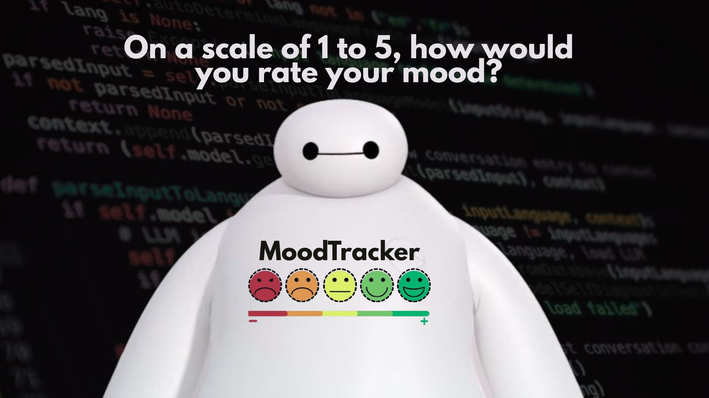

<h3 align="center">
  <a href="#📦-features">Features</a> •
  <a href="#🛠️-requirements">Requirements</a> •
  <a href="#🚀-usage">Usage</a> •
  <a href="#🧪-example-usage">Example Usage</a> •
  <a href="#👤-credits">Credits</a> •
  <a href="#⚖️license">License</a> •
  
</h3>

<h1 align="center">
 🙂 MOOD TRACKER 🙂
</h1>

### 📌 Project Overview

**Mood Tracker** is a Python console-based application that allows users to create accounts, sign in, and log their daily moods. Each mood entry includes an emoji, a rating, an optional message, and the automatic date and time of submission. Data is stored using .csv files for simplicity and accessibility.

## 📦 Features
- 🔑 User passwords are securely stored (using the hashlib library)
- 🔐 Encrypted mood entries (using Fernet encryption)
- 📝 Save mood, tags, and optional message
- 📅 View all mood logs with date
- 📊 View average mood with emoji scale and helpful feedback
- 💡 Clean terminal interface with friendly prompts

## 🛠️ Requirements
- python 3.x
- cryptography library
- To install dependencies:
    ```bash
    pip install cryptography
    ```

## 🚀 Usage
1. Clone the repository or download the files manually
2. Project Folder Structure:
    ```bash
    mood_tracker/
    |
    ├── main.py
    ├── user.py
    ├── mood.py
    ├── utils.py
    ├── secret.key
    |
    ├── data/
    │   ├── users.csv
    │   └── moods/
    │       └── username_entries.csv
    ```
3. Run the application:
    ```bash
    python main.py
    ```

## 🧪 Example Usage
1. Account Management

    ```bash
    ─────────────🙂 Mood Tracker 🙂─────────────

    Choose an option:
    1. Create Account
    2. Log in
    3. Quit
    Enter your choice (1-3):

    ```
    - To **create an account**c, enter your username and password. The password will be hashed for security.
    - To **log in**, enter the same credentials. If correct, you will be welcomed.

2. Interact with the Main Menu. You’ll see:
    ```bash
    ───────────────🙂 Main Menu 🙂───────────────
    Welcome back, [username]!

    Choose an option:
    1. Set mood today
    2. View all mood entries
    3. Get average mood
    4. Quit

    Enter your choice (1-4):
    ```
3. Set your mood for today.
    ```bash
    ─────────────🙂 Set Mood 🙂─────────────

    💗 How are you, fatima?

    5. 😄  (Very Happy)
    4. 😊  (Happy)
    3. 🫤  (Neutral)
    2. 😓  (Sad)
    1. 🥲  (Very Sad)

    Enter your choice (1-5): 5

    🏷️  Tags (use #tag format):  #happy
    🗨️  Message (optional):  Just finished this simple program

    Mood entry saved successfully!
    Press Enter to return to the main menu...
    ```

4. View Mood Entries
    - Past moods will be listed from the encrypted CSV file.

5. See Your Average Mood
    - Summary with an arrow pointer and a motivational message based on your mood history.

6. Quit the App
    - Choose option 4 or press Ctrl + C to stop the program

## 👤 Credits
Created by **Fatima Pura** ✨  
>A first-year Computer Science student currently building a strong foundation in Python. 

## ⚖️ License
MIT License

Copyright (c) 2025 Fatima Pura

Permission is hereby granted, free of charge, to any person obtaining a copy
of this software and associated documentation files (the "Software"), to deal
in the Software without restriction, including without limitation the rights
to use, copy, modify, merge, publish, distribute, sublicense, and/or sell
copies of the Software, and to permit persons to whom the Software is
furnished to do so, subject to the following conditions:

The above copyright notice and this permission notice shall be included in all
copies or substantial portions of the Software.

THE SOFTWARE IS PROVIDED "AS IS", WITHOUT WARRANTY OF ANY KIND, EXPRESS OR
IMPLIED, INCLUDING BUT NOT LIMITED TO THE WARRANTIES OF MERCHANTABILITY,
FITNESS FOR A PARTICULAR PURPOSE AND NONINFRINGEMENT. IN NO EVENT SHALL THE
AUTHORS OR COPYRIGHT HOLDERS BE LIABLE FOR ANY CLAIM, DAMAGES OR OTHER
LIABILITY, WHETHER IN AN ACTION OF CONTRACT, TORT OR OTHERWISE, ARISING FROM,
OUT OF OR IN CONNECTION WITH THE SOFTWARE OR THE USE OR OTHER DEALINGS IN THE
SOFTWARE.
